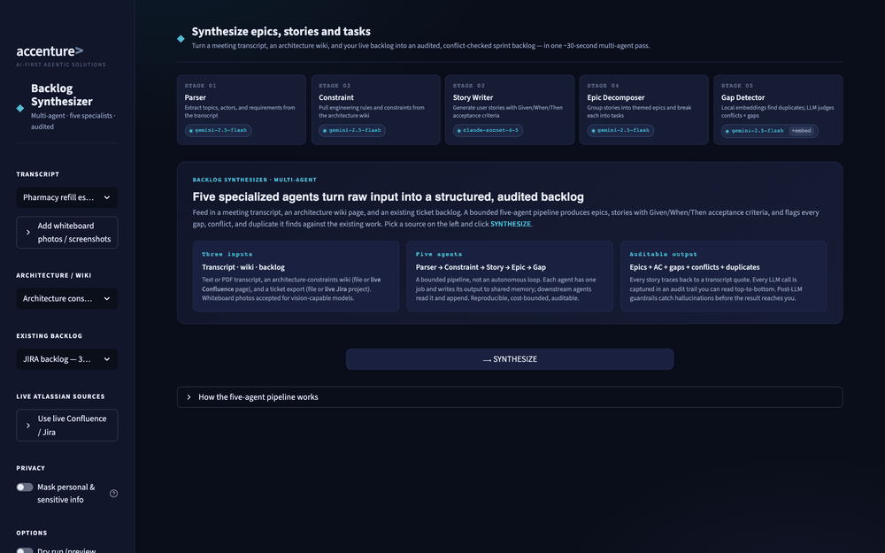
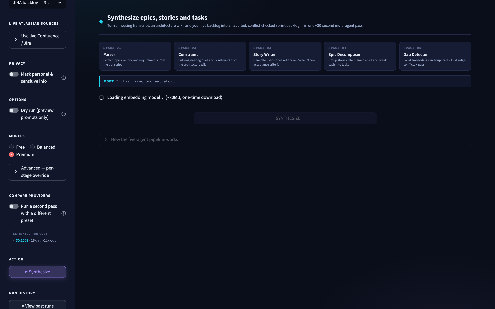
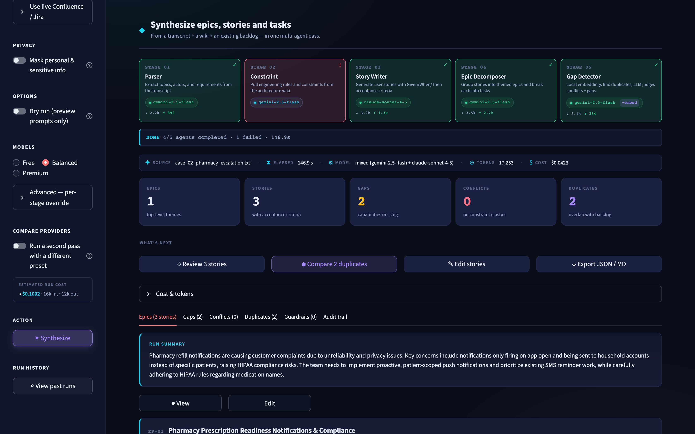
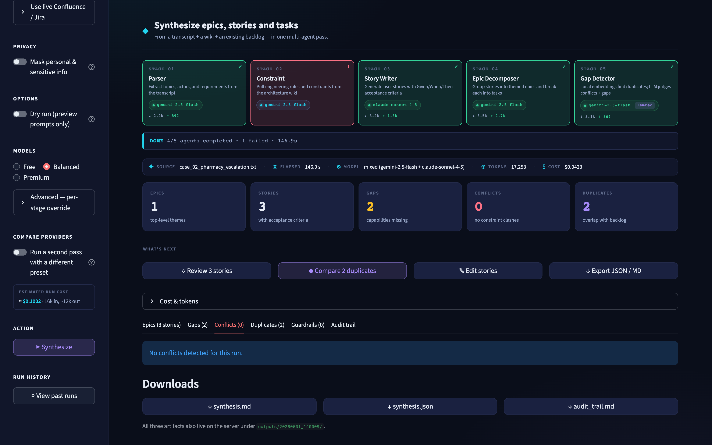
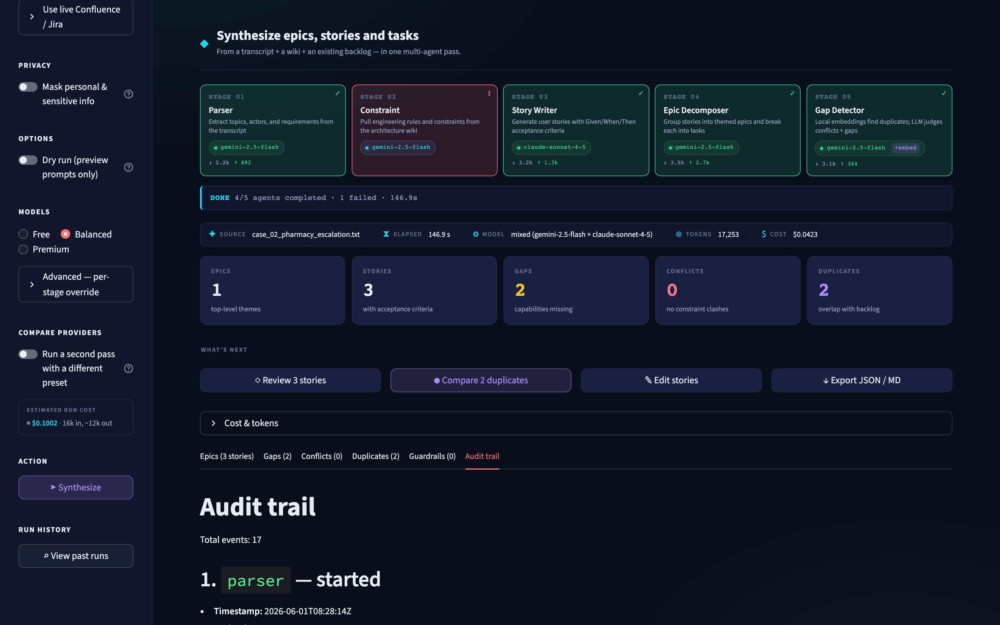

# Backlog Synthesizer

> **Version:** V2 (`v2_ui_polish`). A frozen V1 snapshot is preserved at [versions/v1_baseline/](versions/v1_baseline/).

A multi-agent AI system that ingests customer meeting transcripts, architecture wikis, and existing engineering backlog tickets — and synthesizes the result into a structured set of epics, user stories, and tasks. Detects gaps and conflicts. Maintains an audit trail of every agent decision.

Built as a demonstration of practical multi-agent AI engineering — bounded, testable, with persistent memory and an evaluation harness.

The bundled sample data is themed around **NorthStar Retail**, a fictional national retail giant with ~2,000 stores spanning grocery, electronics, apparel, home goods, pharmacy, and auto service.

---

## Demo

> Capture instructions for these images are in [docs/screenshots/](docs/screenshots/) — run `make ui`, synthesize the bundled sample, and save the frames. They render here automatically once added.



*Home → five-agent pipeline → epics/stories/tasks → gaps & conflicts → audit trail.*

| | |
|---|---|
|  |  |
| The five-agent pipeline, live | Structured output with traceable evidence |
|  |  |
| Gap, conflict & duplicate detection | Full per-agent audit trail |

Or run it yourself in one command: `make demo` (CLI) or `make ui` (web).

---

## What it does

Feed it any combination of these:

- **Customer / stakeholder meeting transcripts** (`.txt`, `.md`, `.pdf`)
- **Architecture / wiki exports** describing constraints, integrations, platform limits (`.md`)
- **Existing backlog tickets** from JIRA or GitHub Issues (real API integration optional; mocked JSON acceptable)

Get back a structured synthesis:

- **Epics** — high-level themes (e.g., "Loyalty Program Modernization")
- **Stories** — user stories under each epic with full acceptance criteria in Given/When/Then form
- **Tasks** — concrete implementation steps under each story
- **System / feature tags** — `mobile-app`, `pos`, `loyalty`, `inventory`, etc.
- **Gaps** — important capabilities the requirements imply but the existing backlog hasn't planned
- **Conflicts** — new requests that contradict architectural constraints or existing in-flight work
- **Duplicates** — new requests that overlap with items already in JIRA / GitHub

Outputs are written to `outputs/` as both `.json` (machine-readable) and `.md` (human-shareable). Every agent decision is captured in an audit log alongside the output.

---

## Why this exists (vs. the simpler single-agent version)

The simpler single-agent version (extract stories → flag duplicates) works for tidy inputs. It breaks down when:

- Inputs come from **multiple heterogeneous sources** (a transcript, a Confluence page, a JIRA export)
- The output needs **hierarchy** (epics → stories → tasks), not a flat list
- Detection has to span beyond duplicates to **gaps and constraint conflicts**
- You need to **show your reasoning** for compliance / handoff to a human owner

A multi-agent design lets each agent do one thing well, write its intermediate findings to a shared memory, and let downstream agents reason from that. The audit log captures the full reasoning chain.

---

## Architecture (at a glance)

A single **Orchestrator** coordinates five specialized agents, each calling tools for I/O and the Claude API for reasoning. All agents share a memory store; every decision goes into the audit log.

```
       ┌──────────────────────┐
       │     Orchestrator     │
       └──────────┬───────────┘
                  │
   ┌──────────────┼──────────────┬──────────────┬──────────────┐
   ▼              ▼              ▼              ▼              ▼
┌──────┐     ┌─────────┐    ┌──────────┐   ┌───────────┐   ┌──────────┐
│Parser│ →   │Constraint│ → │  Story   │ → │   Epic    │ → │   Gap    │
│Agent │     │Extractor │   │  Writer  │   │Decomposer │   │ Detector │
└──────┘     └─────────┘    └──────────┘   └───────────┘   └──────────┘
   ▲              ▲              ▲              ▲              ▲
   └──────────────┴──────────────┴──────────────┴──────────────┘
                  │              │              │
                  ▼              ▼              ▼
              ┌─────────────────────────────────────┐
              │      Shared Memory + Audit Log      │
              │  (vector store + structured trace)  │
              └─────────────────────────────────────┘
                  ▲              ▲              ▲
                  │              │              │
              ┌───┴────┐    ┌───┴────┐    ┌───┴────┐
              │ JIRA   │    │Confluence│   │ GitHub │
              │ tool   │    │  tool    │   │  tool  │
              └────────┘    └────────┘    └────────┘
              (mocked)       (mocked)      (mocked)
```

See [architecture.md](architecture.md) for the detailed diagram + agent contracts.

---

## Setup

### Prerequisites

- Python 3.9+
- An Anthropic API key

### Installation

```bash
cd backlog-synthesizer
python3 -m venv venv
source venv/bin/activate
pip install -r requirements.txt
```

### Configure your API key

```bash
cp .env.example .env
# Edit .env and add your real key
```

### Run the bundled sample

```bash
python src/main.py \
    --transcript samples/meeting_notes.txt \
    --constraints samples/architecture_constraints.md \
    --backlog samples/jira_backlog.json
```

Outputs land in `outputs/<timestamp>/`:
- `synthesis.json` — full structured result
- `synthesis.md` — human-readable Markdown
- `audit_trail.md` — every agent decision with timestamps and reasoning

A canonical run on the bundled sample is already checked in under
[`outputs/`](outputs/) so reviewers can inspect the artifacts without
spending API credit.

### Run the tests

```bash
pytest tests/ -v
```

**128 tests across 9 files**, all mocked end-to-end (zero API credit, ~1s):
- `test_agents.py` — per-agent unit tests + `MemoryStore` / `AuditLog`
- `test_orchestrator.py` — five-agent handoff + output formatter
- `test_redactor.py`, `test_guardrails.py`, `test_compare_mode.py`
- `test_jira_live.py` — live JQL **and Jira write-back** (`create_issue` / `publish_synthesis`)
- `test_confluence_live.py`, `test_vision.py`, `test_evaluation_runner.py`

### Run the evaluation harness

```bash
# Deterministic metrics only (offline-friendly, but still hits Claude unless mocked)
python evaluation/run_evaluation.py

# Add the LLM-as-judge for qualitative scoring (acceptance-criteria quality,
# priority justification, story granularity, tag accuracy, conflict reasoning).
python evaluation/run_evaluation.py --use-llm-judge

# Restrict to one golden case
python evaluation/run_evaluation.py --case case_07

# After running multiple times, view the trend
python evaluation/dashboard.py
```

Result files land under `evaluation/results/<timestamp>/` (one per case + an
aggregate `summary.json` + a human-readable `README.md`). The dashboard
compares the latest run against the previous one and surfaces any case whose
deterministic score dropped ≥ 0.10.

### A/B compare two prompt variants

```bash
python evaluation/ab_compare.py \
    --prompt parser_prompt.md \
    --variant prompts/experiments/parser_prompt_v2.md \
    --use-llm-judge
```

Runs the full golden suite twice (once with the prompt currently on disk,
once with the candidate), reports per-case deltas, and writes a `report.json`
under `evaluation/results/ab/`.

---

## Optional capabilities

- **PDF transcripts** — `python -m src.main --transcript meeting.pdf …` works out of the box; pypdf parses text-extractable PDFs (scanned/image PDFs would need OCR).
- **Live Atlassian sources** — fill in the `JIRA_*` block in `.env` (one set of credentials covers both products). Then either:
  - **CLI:** `python src/main.py --transcript notes.txt --confluence-page-id 65830 --live-jira`
  - **UI:** open the sidebar "Live Atlassian sources" expander, toggle Confluence (paste the page id) and/or Jira, click Run.
  - The Confluence path calls `GET /wiki/api/v2/pages/{id}` with storage-format → text. The Jira path calls `GET /rest/api/3/search/jql` paginated, project-scoped to `JIRA_PROJECT_KEY`, capped at 200 issues per run.
  - Both successes/failures are recorded in `audit_trail.md` as `live_confluence_fetch_ok` / `live_jira_fetch_ok` (or `_failed`) so each run's data provenance is traceable after the fact.
- **Seed a Confluence space** — `python scripts/seed_confluence.py` reads `samples/architecture_constraints.md` and `samples/product_strategy.md`, converts markdown to Confluence storage format, and creates two pages in the first non-personal space. Use `--space SD` to target a specific space, `--dry-run` to preview the XHTML without calling the API.
- **Persistent vector memory** — set `MEMORY_PERSISTENT=1` to cache embeddings under `.cache/memory/` between runs. Re-runs on the same backlog skip the embed step.
- **Strict PII redaction** — pass `strict_redact=True` to `Orchestrator.run` (alongside `redact_pii=True`) to halt the run if any PII pattern slips past the redactor at a tool boundary. Audit-logged.
- **Cost panel** — every UI run shows per-stage tokens, per-agent cost at the active stage's model rate, and a recent-cost-trend chart across the last 10 saved runs.
- **Story evidence** — each story carries the customer quote that motivated it (`story.evidence[0].raw_quote`), surfaced inline on the Epics tab. Evidence is attached deterministically by the system from the topic the story cites (`source_topic_id`), not produced by the model — so it can't be hallucinated.

---

## Project structure

```
backlog-synthesizer/
├── README.md                        ← you are here
├── LICENSE
├── requirements.txt
├── .env.example
├── architecture.md                  ← multi-agent architecture diagram
├── src/
│   ├── main.py                      ← CLI entry point
│   ├── orchestrator.py              ← multi-agent coordinator
│   ├── input_loader.py              ← reads txt / md / pdf / json
│   ├── output_formatter.py          ← epic / story / task hierarchy → json + md
│   ├── logger_setup.py
│   ├── agents/
│   │   ├── base.py                  ← Agent base class (memory access + audit emission; retry lives in tools)
│   │   ├── parser_agent.py          ← extracts raw content from transcripts
│   │   ├── constraint_agent.py      ← extracts architecture constraints from wiki
│   │   ├── story_writer_agent.py    ← drafts user stories
│   │   ├── epic_decomposer_agent.py ← groups stories → epics, breaks into tasks
│   │   └── gap_detector_agent.py    ← finds gaps, conflicts, duplicates
│   ├── tools/
│   │   ├── base.py
│   │   ├── claude_tool.py           ← wrapped Claude API client
│   │   ├── jira_tool.py             ← mocked JIRA API
│   │   ├── confluence_tool.py       ← mocked Confluence API
│   │   └── github_tool.py           ← mocked GitHub Issues API
│   └── memory/
│       ├── store.py                 ← shared memory (vector + KV)
│       └── audit_log.py             ← structured trace events
├── prompts/
│   ├── system_prompt.md             ← shared role + global rules
│   ├── parser_prompt.md
│   ├── constraint_extractor_prompt.md
│   ├── story_writer_prompt.md
│   ├── epic_decomposer_prompt.md
│   └── gap_detector_prompt.md
├── samples/
│   ├── README.md                    ← what's in each sample, NorthStar Retail fiction
│   ├── meeting_notes.txt            ← customer meeting transcript
│   ├── architecture_constraints.md  ← Confluence-style export
│   ├── product_strategy.md          ← strategy document
│   ├── jira_backlog.json            ← existing JIRA tickets (mocked)
│   └── github_issues.json           ← existing GitHub issues (mocked)
├── evaluation/
│   ├── golden_dataset/              ← 10 hand-curated input/expected pairs incl. negative / conflict-heavy / ambiguity / compliance cases
│   ├── metrics.py                   ← completeness, tag accuracy, F1 for conflicts
│   ├── llm_as_judge.py              ← LLM-based qualitative scoring (5 dimensions, scores normalised to [0,1])
│   ├── run_evaluation.py            ← runs the suite, writes per-case + aggregate results under results/<ts>/
│   ├── dashboard.py                 ← trend / regression dashboard across past runs
│   ├── ab_compare.py                ← A/B compare two prompt variants on the same golden set
│   └── results/                     ← evaluation artifacts (per-run summary, scorecards, A/B reports)
├── tests/
│   ├── test_orchestrator.py         ← end-to-end with mocked Claude
│   └── test_agents.py               ← per-agent unit tests + memory/audit tests
└── docs/
    ├── AGENT_DESIGN.md              ← why this multi-agent design
    ├── PROMPT_ENGINEERING.md
    └── AI_USAGE_SDLC.md             ← how AI was used in each SDLC phase
```

---

## How AI is used

The Claude API is called by each agent for its specific reasoning task. Outside those calls, everything is deterministic Python.

| Agent | What it reasons about | Tools it calls |
|---|---|---|
| **Parser** | What entities / topics are in the raw transcript | `claude_tool` |
| **Constraint Extractor** | What architectural rules / integrations / limits apply | `claude_tool`, `confluence_tool` |
| **Story Writer** | What user stories with AC fit the customer asks | `claude_tool` |
| **Epic Decomposer** | How to group stories into epics + break them into tasks | `claude_tool` |
| **Gap Detector** | Which new asks are duplicates, conflicts, or gaps | `claude_tool`, `jira_tool`, `github_tool` |

Embedding-based retrieval (from the simpler v1) lives in `src/memory/store.py` and is used by the Gap Detector to surface candidate backlog items before the LLM reranks.

---

## License

MIT — use freely.
