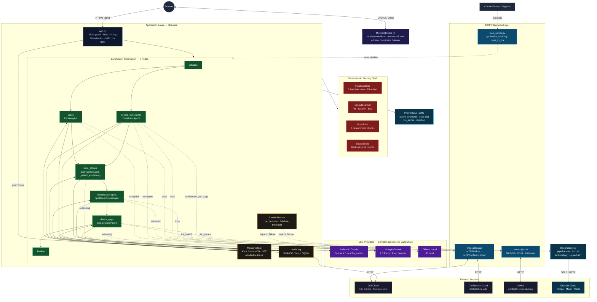
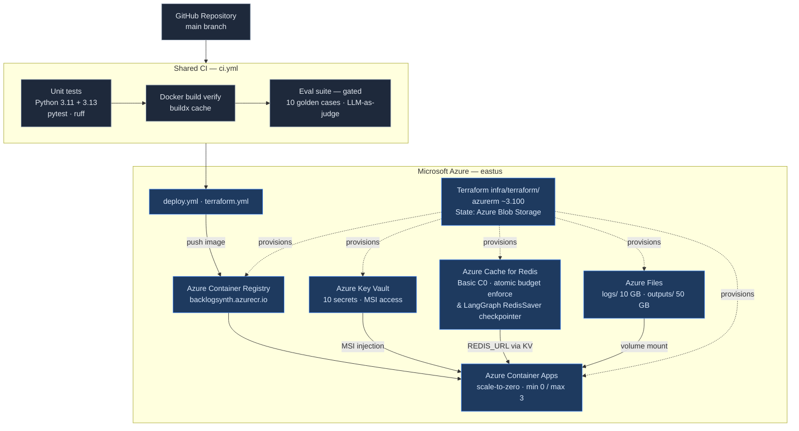
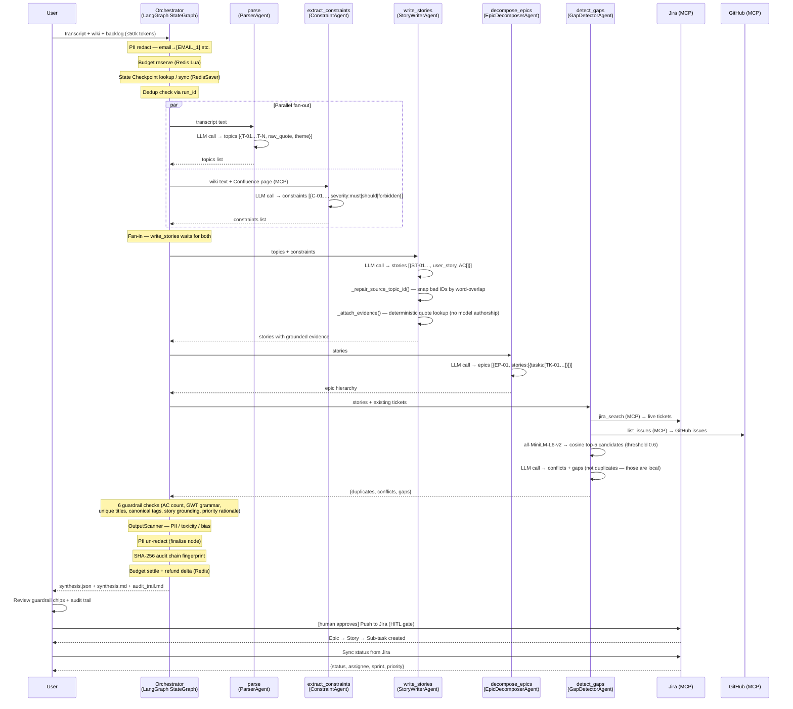
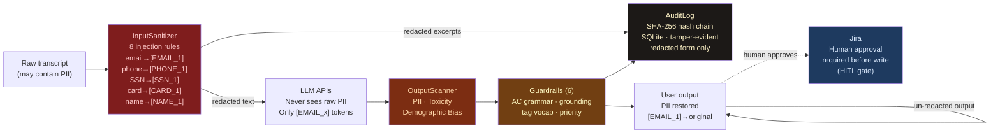
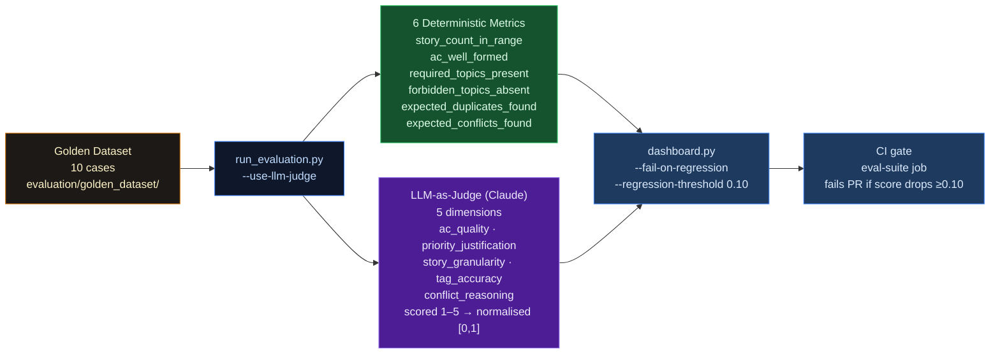

# Architecture

Enterprise production-grade multi-agent AI system for sprint backlog synthesis.  
**Accenture · AI-First Agentic Solutions**

---

## Application & AI Layer

---

## Infrastructure & Deployment

---

## Agent Pipeline Detail

---

## Authentication & Security Layer

### Microsoft Entra ID SSO (`src/entra_auth.py`)

| Concern | Implementation |
|---|---|
| Token verification | RS256 signature via Microsoft JWKS endpoint (`PyJWKClient` + PyJWT) |
| CSRF protection | Server-side state nonce store — UUID per request, 600s TTL, single-use |
| Config freshness | `_cfg()` reads env vars dynamically on every call (no Streamlit module-cache stale values) |
| HTTP errors | `raise_for_status()` on token exchange — 4xx/5xx surfaces immediately |
| Issuer trust | Accepts both `login.microsoftonline.com/{tid}/v2.0` and `sts.windows.net/{tid}/` |
| Misconfiguration guard | Hard-fail if `AUTH_DISABLED=1` and `ENTRA_TENANT_ID` are both set |

### Jira Security (`src/tools/jira_tool.py`)

| Concern | Implementation |
|---|---|
| Project key injection | Regex `^[A-Z][A-Z0-9]{1,9}$` validated at init — raises `ToolError` on mismatch |
| JQL injection | Full escaping of `\`, `"`, `'` in all search strings before JQL interpolation |

---

## Security & Data Flow

### Azure resource summary

| Resource | Detail |
|---|---|
| Container Registry | Azure Container Registry — `backlogsynth.azurecr.io` |
| Container Runtime | Azure Container Apps — scale-to-zero, min 0 / max 3 replicas |
| Secret Storage | Azure Key Vault — 10 secrets, User-Assigned Managed Identity (MSI) |
| Budget & State Checkpoints | Azure Cache for Redis — Basic C0, atomic Lua reserve/settle & RedisSaver checkpointer |
| Persistent Storage | Azure Files — `logs/` 10 GB + `outputs/` 50 GB (SMB share) |
| Logging | Log Analytics Workspace — 30-day retention |
| IaC state backend | Azure Blob Storage (`stbacklogstate`) |
| IaC provider | `azurerm ~3.100` |
| Autoscaling | Container Apps built-in — min 0 / max 3 replicas |
| Rollback | Revision traffic weights — instant cutover to prior revision |

---

## Evaluation & Quality Harness

