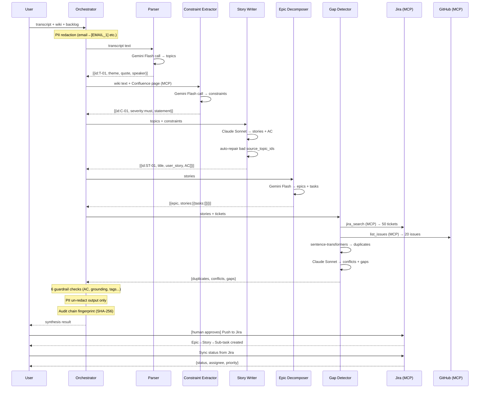
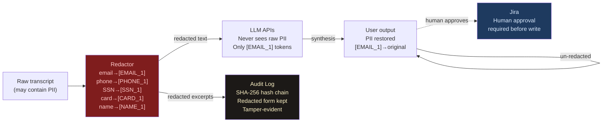

# Architecture

Enterprise production-grade multi-agent AI system for sprint backlog synthesis.  
**Accenture · AI-First Agentic Solutions**

---

## System Architecture

```mermaid
flowchart TB
    %% ── User & Identity ──────────────────────────────────────────
    Browser((Browser)):::user
    EntraID["Microsoft Entra ID\nnorthstarretailcorp.onmicrosoft.com\nadmin / contributor / viewer"]:::auth

    Browser <-->|OAuth2 / OIDC| EntraID

    %% ── Application ──────────────────────────────────────────────
    Browser -->|HTTPS| App

    subgraph App["Application Layer — Streamlit"]
        UI["app.py\nRole-gated UI · Feature flags\nRate limiting · PII redaction\nHuman-in-the-loop Jira gate\nExpandable profile panel"]:::app

        subgraph Orch["Orchestrator (orchestrator.py)"]
            P["Parser\nAgent"]:::agent
            CE["Constraint\nExtractor"]:::agent
            SW["Story\nWriter"]:::agent
            ED["Epic\nDecomposer"]:::agent
            GD["Gap\nDetector"]:::agent
            P --> CE --> SW --> ED --> GD
        end

        Mem["MemoryStore\nKV + Vector\nChromaDB"]:::store
        Audit["AuditLog\nSHA-256 hash chain\nSQLite · 26+ events/run"]:::store

        UI --> Orch
        P & CE & SW & ED & GD <--> Mem
        P & CE & SW & ED & GD --> Audit
    end

    %% ── LLM Providers ─────────────────────────────────────────────
    subgraph LLMs["LLM Providers"]
        Claude["Anthropic Claude\nSonnet 4.5\n+ cache_control"]:::llm
        Gemini["Google Gemini\n2.5 Flash / Pro\n+ JSON mode"]:::llm
        Ollama["Ollama Local\nllama3.2:3b\n+ format:json"]:::llm
    end

    SW & GD -.->|reasoning| Claude
    P & CE & ED -.->|extraction| Gemini
    P & CE & ED -.->|local free| Ollama

    %% ── MCP Layer ─────────────────────────────────────────────────
    subgraph MCP["MCP Integration Layer"]
        AtlMCP["mcp-atlassian\nMCPJiraTool\nMCPConfluenceTool"]:::mcp
        GHubMCP["server-github\nMCPGithubTool\n20 issues live"]:::mcp
        MCPSvr["mcp_server.py\nsynthesize_backlog\npreview_prompts\nget_run_history\npush_to_jira"]:::mcp
    end

    GD -.->|jira_search| AtlMCP
    CE -.->|confluence_get_page| AtlMCP
    GD -.->|list_issues| GHubMCP
    ExtAgent["Claude Desktop\nor other agents"]:::user -.->|tool calls| MCPSvr
    MCPSvr -.->|runs pipeline| Orch

    %% ── External Services ─────────────────────────────────────────
    subgraph External["External Services"]
        Jira["Jira Cloud\nNS project\n127 tickets live\ntwo-way sync"]:::ext
        Confluence["Confluence Cloud\nArchitecture wiki"]:::ext
        GitHub["GitHub\nnorthstar-retail-backlog\n20 seeded issues"]:::ext
        Grafana["Grafana Cloud\nTempo — traces\nMimir — metrics\nAlerting rules"]:::obs
    end

    AtlMCP <-->|REST| Jira
    AtlMCP <-->|REST| Confluence
    GHubMCP <-->|REST| GitHub
    UI -->|Push synthesis| Jira
    UI -->|Sync status| Jira

    %% ── Observability ─────────────────────────────────────────────
    OTel["OpenTelemetry\npipeline.run\nstage.* spans\nllm.call spans\ntool.* spans\nguardrail.* spans"]:::obs
    App --> OTel
    OTel -->|OTLP / HTTP| Grafana

    %% ── Deployment ────────────────────────────────────────────────
    subgraph Deploy["Deployment (Azure)"]
        GHA["GitHub Actions\nCI: 210 tests + lint\nCD: build→push→deploy"]:::deploy
        ACR["Azure Container\nRegistry"]:::deploy
        ACA["Azure Container Apps\npython:3.11-slim\nscale-to-zero"]:::deploy
        KV["Azure Key Vault\nAnthropicKey\nJiraToken\nGoogleKey"]:::deploy
        AF["Azure Files\nlogs/ outputs/\nper-user scoped"]:::deploy
        TF["Terraform IaC\nmain.tf · variables.tf\noutputs.tf"]:::deploy
    end

    GHA -->|push image| ACR
    GHA -->|deploy| ACA
    ACR --> ACA
    KV --> ACA
    AF --> ACA
    TF -.->|provisions| ACR & ACA & KV & AF

    App -.- ACA

    %% ── Styles ────────────────────────────────────────────────────
    classDef user     fill:#1e293b,stroke:#94a3b8,color:#e2e8f0
    classDef auth     fill:#1e1b4b,stroke:#818cf8,color:#e0e7ff
    classDef app      fill:#0f172a,stroke:#3b82f6,color:#bfdbfe
    classDef agent    fill:#14532d,stroke:#4ade80,color:#dcfce7
    classDef llm      fill:#4c1d95,stroke:#a78bfa,color:#ede9fe
    classDef mcp      fill:#0c4a6e,stroke:#38bdf8,color:#e0f2fe
    classDef store    fill:#1c1917,stroke:#d97706,color:#fef3c7
    classDef ext      fill:#1a1a2e,stroke:#64748b,color:#cbd5e1
    classDef obs      fill:#0d3349,stroke:#22d3ee,color:#cffafe
    classDef deploy   fill:#1e3a5f,stroke:#3b82f6,color:#dbeafe
```

---

## Agent Pipeline Detail

---

## Security & Data Flow

