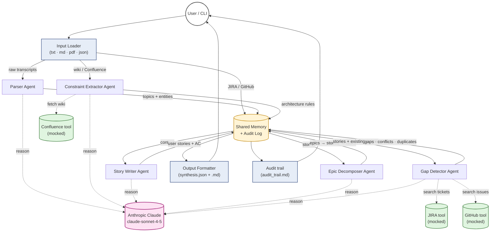

# Architecture

A multi-agent Python system. A single orchestrator coordinates five specialized agents. Each agent has one reasoning job, calls Claude through a wrapped tool, and writes its findings to a shared memory store. Every agent decision goes into a structured audit log so a human reviewer can trace exactly how the final synthesis was produced.

## High-level data flow



## The five agents

| Agent | Single responsibility | Inputs | Outputs (written to memory) | Tools used |
|---|---|---|---|---|
| **Parser** | Extract distinct topics / entities / asks from raw transcript text | Raw transcripts (txt/md/pdf) | List of `topic` records with raw quotes | `claude_tool` |
| **Constraint Extractor** | Pull architectural constraints, integrations, and platform rules from wiki / Confluence content | Confluence-style markdown | List of `constraint` records (must / should / forbidden) | `claude_tool`, `confluence_tool` |
| **Story Writer** | Draft user stories with Given/When/Then acceptance criteria for each topic | Topics from Parser, constraints from Constraint Extractor | List of `story` records | `claude_tool` |
| **Epic Decomposer** | Group stories into epics; break each story into 3-7 concrete tasks | Stories from Story Writer | Tree of `epic → stories → tasks` | `claude_tool` |
| **Gap Detector** | Find conflicts (vs. constraints) and gaps via the LLM; duplicates are detected separately by local embedding similarity | Stories + constraints + existing tickets | Lists of `duplicate` (from embeddings), `conflict`, `gap` records | `claude_tool`, `embedding_tool`, `jira_tool`, `github_tool` |

Each agent runs independently. The orchestrator chains them in this order, blocking on the previous agent's memory writes before invoking the next.

## Shared memory

A single `MemoryStore` instance is passed to every agent. Two flavors of storage:

**Vector memory** (in-process: `sentence-transformers` + numpy cosine search) — for semantic similarity:
- Existing JIRA / GitHub tickets are embedded once at the start of a run using `all-MiniLM-L6-v2`
- Embeddings are held in a numpy matrix for the lifetime of the run; cosine similarity for top-K retrieval
- The Gap Detector queries this to find candidates for each new story before LLM reranking
- ChromaDB is listed in `requirements.txt` and the `MemoryStore` interface is shaped so a Chroma-backed store can be swapped in without touching agent code — for runs where embeddings must persist across processes

**Structured KV memory** — for agent handoff:
- `topics`, `constraints`, `stories`, `epics`, `gaps`, `conflicts`, `duplicates`
- Each entry includes the agent that wrote it, a timestamp, and a reference to the source content
- Downstream agents read structured records, not raw text

Why both? Vector for fuzzy lookup (`find tickets similar to this story`), KV for explicit handoff (`give me the list of stories so I can group them into epics`).

## Audit log

Every agent emits **trace events** to an append-only audit log:

```json
{
  "timestamp": "2026-05-19T22:14:31Z",
  "agent": "story_writer",
  "event": "story_drafted",
  "story_id": "ST-04",
  "source_topic_id": "T-02",
  "prompt_excerpt": "...",
  "response_excerpt": "...",
  "tokens_used": 1487,
  "reasoning": "Source quote 'cashiers can't process returns when WiFi drops' clearly implies offline-tolerant return flow; categorized as 'pos' + 'offline-mode'."
}
```

At the end of the run, the audit log is rendered to `audit_trail.md` — a human-readable walkthrough of every decision the system made. This addresses the brief's requirement: *"Audit logs must show how conclusions were reached."*

## Why multi-agent (vs. one big prompt)

The v1 single-agent design works when:
- Input is a single source
- Output is a flat list
- Detection is duplicate-only

This system breaks all three assumptions. Three reasons multi-agent fits:

1. **One reasoning task per prompt.** Story-writing reasoning is different from gap-detection reasoning. Cramming them into one prompt degraded both (we proved this in v1).
2. **Sequencing matters.** Story Writer needs to read constraints written by Constraint Extractor. Gap Detector needs to read stories written by Story Writer. A shared memory + ordered orchestrator makes this explicit.
3. **Tool invocation is bounded per agent.** Only the Gap Detector calls JIRA/GitHub tools. Only the Constraint Extractor calls Confluence. Bounding tool access per agent makes the system safer and easier to audit.

## Why this is *bounded* multi-agent, not autonomous

This is not a free-form agent system where any agent can call any tool and the run ends when the model decides it's done. It's a **fixed pipeline of specialized agents** with deterministic ordering. The benefits:

- **Reproducible.** Same input → same agent order → comparable output.
- **Testable.** Each agent has a single mocked-Claude unit test.
- **Cost-bounded.** Each run makes exactly one Claude call per agent — five calls in the standard pipeline (one per agent). The number is bounded up front.
- **Auditable.** The audit log is a complete linear trace, not a graph of agent-calls-agent.

Autonomous agent loops (where the model decides what tool to call next) are powerful but harder to audit, harder to budget, and harder to test. This system gets the benefits of specialization without the unpredictability.

## Component table

| File | Responsibility |
|---|---|
| `src/main.py` | CLI entry; loads `.env`; parses args; calls orchestrator |
| `src/orchestrator.py` | Multi-agent coordinator; constructs memory + audit log; runs agents in order |
| `src/agents/base.py` | `Agent` base class with memory access, audit emission, and prompt-template loading. Retry logic lives in each tool (e.g. `ClaudeTool`), not in `Agent`, so tools can tune their own backoff |
| `src/agents/parser_agent.py` | Topic extraction from transcripts |
| `src/agents/constraint_agent.py` | Architecture constraint extraction from wiki |
| `src/agents/story_writer_agent.py` | User stories + acceptance criteria |
| `src/agents/epic_decomposer_agent.py` | Epic grouping + task breakdown |
| `src/agents/gap_detector_agent.py` | Duplicates / conflicts / gaps detection |
| `src/tools/claude_tool.py` | Wrapped Claude API client with retry + JSON extraction + vision payloads |
| `src/tools/gemini_tool.py` | Google Gemini client (`google-genai`), same `call_for_json` interface |
| `src/tools/embedding_tool.py` | Local `sentence-transformers` duplicate detection (no LLM call) |
| `src/tools/jira_tool.py` | JIRA read (mock + live JQL) **and write-back** (`create_issue` / `publish_synthesis`) |
| `src/tools/confluence_tool.py` | Confluence read (mock + live) + markdown→storage write (`seed_confluence.py`) |
| `src/tools/github_tool.py` | GitHub Issues fetch (mock) |
| `src/memory/store.py` | Vector + KV shared memory, content-addressed vector cache |
| `src/memory/audit_log.py` | Append-only trace event log |
| `src/guardrails.py` | Six post-synthesis deterministic checks (non-blocking) |
| `src/redactor.py` | Opt-in PII redaction + strict-redact trust boundary |
| `src/pricing.py` | Per-model token→USD rates for the cost panel |
| `src/input_loader.py` | Reads txt / md / pdf / json |
| `src/output_formatter.py` | Renders epic → story → task hierarchy to JSON + Markdown |
| `app.py` | Streamlit UI (multi-select inputs, live log, top-nav, Create-in-Jira, compare-mode) |
| `evaluation/` | Golden suite, metrics, LLM-as-judge, regression dashboard, A/B, single-prompt baseline |

## Multi-provider, presets, and resilience

The LLM provider is chosen **per stage**, not globally. `_build_tool_for_model` builds a `ClaudeTool` or `GeminiTool` from the model id prefix, and no agent code knows which is behind it. Three presets ship:

- **Free** — Gemini Flash for all five stages.
- **Balanced** (default) — Gemini Flash for the four mechanical stages, Claude Sonnet for the Story Writer (the hardest reasoning).
- **Premium** — Claude Sonnet for all five.

Two opt-in behaviours sit behind an **"Auto-switch model"** toggle (default off, so the exact preset is honoured and easy to verify):

- **Provider failover** — if a stage fails after its tenacity retries (rate limit / 5xx / timeout), the orchestrator retries that one stage on the *other* provider (`_fallback_model`: Claude↔Gemini). Surfaced as an amber **⚠ FAILOVER** live-log line + a `provider_failover` audit event. This keeps a live demo — or compare-mode's all-Gemini "Free" leg — alive through a transient outage.
- **Vision auto-switch** — the Gemini wrapper can't carry image parts, so when a vision attachment is present and the Parser is on Gemini, the Parser is switched to a vision-capable Claude model.

So "exactly one LLM call per agent" is the steady-state; a failover adds at most one retry call on the other provider, and it's always logged.

## Beyond synthesis: live data, write-back, safety

- **Live Atlassian (read).** `JiraTool`/`ConfluenceTool` have a `mode="live"` path: Jira via paginated `/rest/api/3/search/jql`, Confluence via `/wiki/api/v2/pages/{id}`. One API token covers both products.
- **Jira write-back.** `JiraTool.publish_synthesis()` creates the synthesis in live Jira as **Epic → Story → Sub-task** (CLI `--publish-jira`; UI "Create in Jira"). Defensive fallbacks handle differing project configs; partial failures are recorded, not fatal.
- **Vision input.** Vision-capable models accept whiteboard photos / screenshots alongside the transcript (a bundled `samples/whiteboard_sprint_planning.png` is selectable directly).
- **Output guardrails.** Six deterministic post-synthesis checks (AC count/grammar, unique titles, canonical tags, story grounding, priority-rationale rigor) annotate the result without blocking it.
- **PII redaction.** Opt-in regex redaction at the orchestrator boundary, with a strict-redact halt-on-violation trust boundary; the synthesis is un-redacted on the way out while the audit trail stays redacted.

## Error handling and retries

Each agent's tool calls are wrapped in `tenacity` retry logic — exponential backoff with a cap of 3 attempts. Transient errors (rate limit, network failure) retry; deterministic errors (auth failure, bad request) fail fast.

If an individual agent fails permanently:
- Its failure is recorded in the audit log
- Downstream agents are skipped if they depend on its output
- The orchestrator returns whatever was completed before the failure

This means partial results are still useful — a Gap Detector failure still produces a synthesis with stories and epics, just no gap analysis.

## Where AI is used

An LLM (Claude or Gemini, per the active preset) is called once per agent per run — five calls total for the standard pipeline (a failover adds at most one retry on the other provider). Outside those calls, everything is deterministic Python:

- File I/O
- Vector similarity + duplicate detection (sentence-transformers + numpy — no LLM call)
- ID assignment, guardrails, PII redaction
- Audit log writes, token/cost tallying
- Output formatting and Jira issue creation

The boundary is intentional. The model handles judgment (story shape, conflict/gap detection); the framework handles plumbing — and the deterministic layers are exactly why 128 mocked tests can cover the system without spending API credit.
