# Azure End-to-End User Flow

**Backlog Synthesizer — Accenture · AI-First Agentic Solutions**  
Full journey from browser to synthesized Jira backlog, running on Microsoft Azure.

---

## Overview

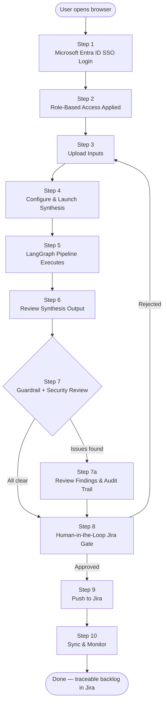

---

## Step 1 — Microsoft Entra ID SSO Login

**What happens on Azure:**

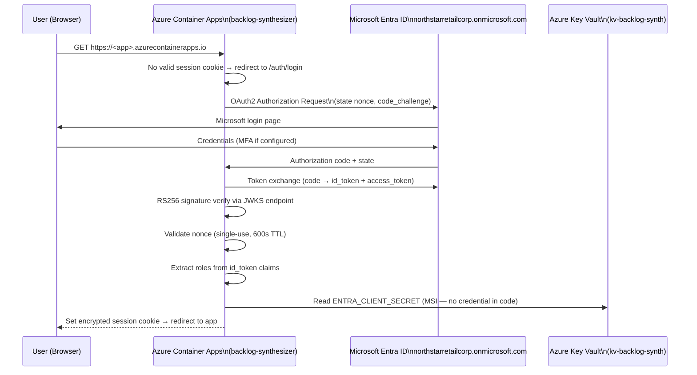

**Azure resources involved:**
- **Azure Container Apps** — hosts `src/entra_auth.py`, handles the OAuth2 flow
- **Azure Key Vault** (`kv-backlog-synth`) — stores `ENTRA_CLIENT_SECRET`, accessed via User-Assigned Managed Identity (no credentials in code or environment)
- **Microsoft Entra ID** — issues tokens for `northstarretailcorp.onmicrosoft.com`

---

## Step 2 — Role-Based Access Applied

After token validation, the user's Entra role claims determine what they can do:

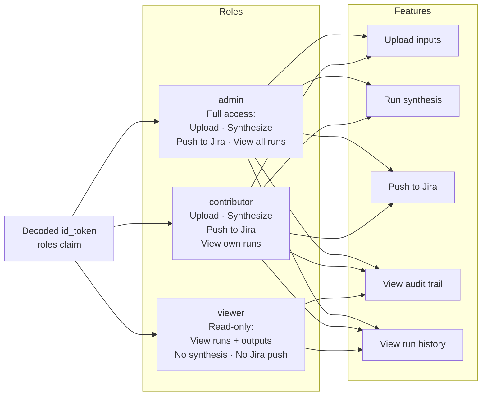

---

## Step 3 — Upload Inputs

The user provides three inputs through the Streamlit UI:

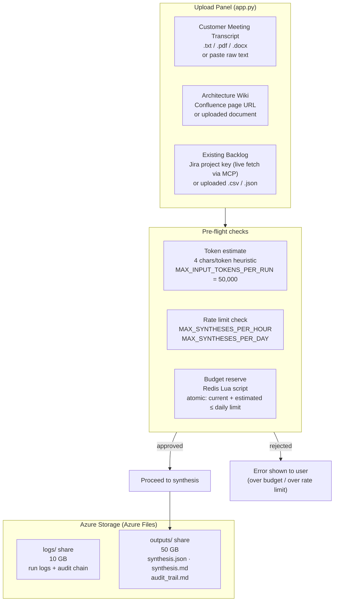

**Where inputs are sanitized:**
- `src/security.py::InputSanitizer` — 8 prompt-injection detection rules strip or redact malicious patterns before any LLM call
- PII redaction (`strict_redact=True`) replaces email, phone, SSN, card numbers, and names with `[EMAIL_1]`, `[PHONE_1]` etc. — raw PII never reaches the LLM

---

## Step 4 — Configure & Launch Synthesis

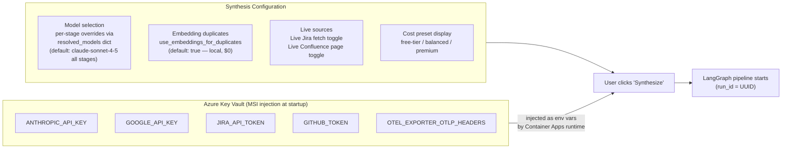

All secrets are **injected at runtime** by Azure Container Apps from Key Vault via the User-Assigned Managed Identity — they are never stored in the Docker image or the Terraform state.

---

## Step 5 — LangGraph Pipeline Executes

This is the core AI processing step. Seven LangGraph nodes run on the Azure Container Apps instance:

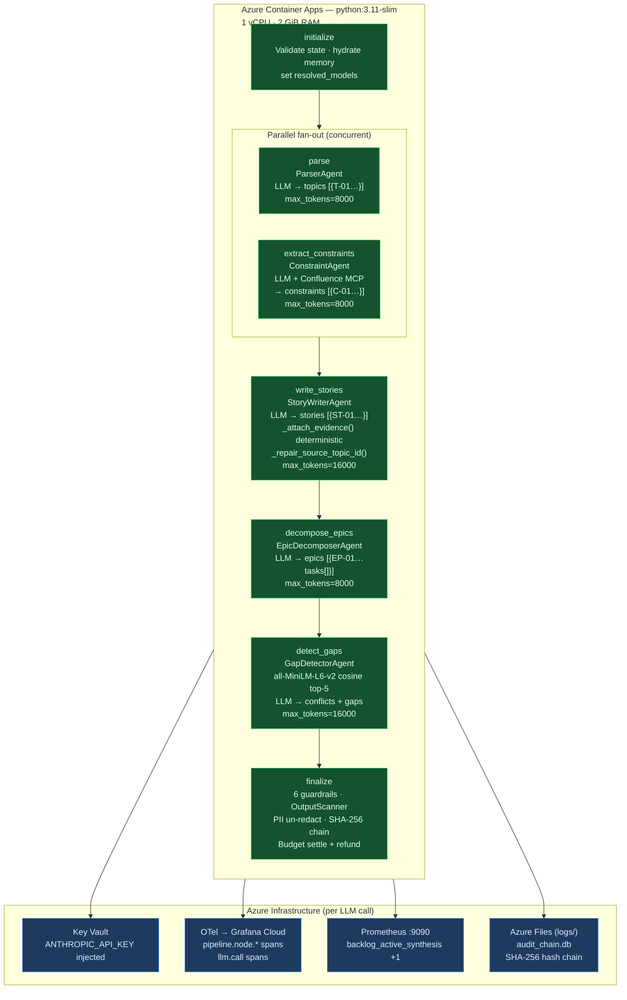

**Token & cost controls during pipeline:**
- `MAX_INPUT_TOKENS_PER_RUN = 50,000` hard ceiling before any spend
- System prompt cached via `cache_control: {"type": "ephemeral"}` — not re-billed per agent
- Per-provider circuit breakers (`CLAUDE_CB`, `GEMINI_CB`) trip after 3 failures — pipeline degrades gracefully

---

## Step 6 — Review Synthesis Output

The Streamlit UI renders the structured output from `synthesis.json`:

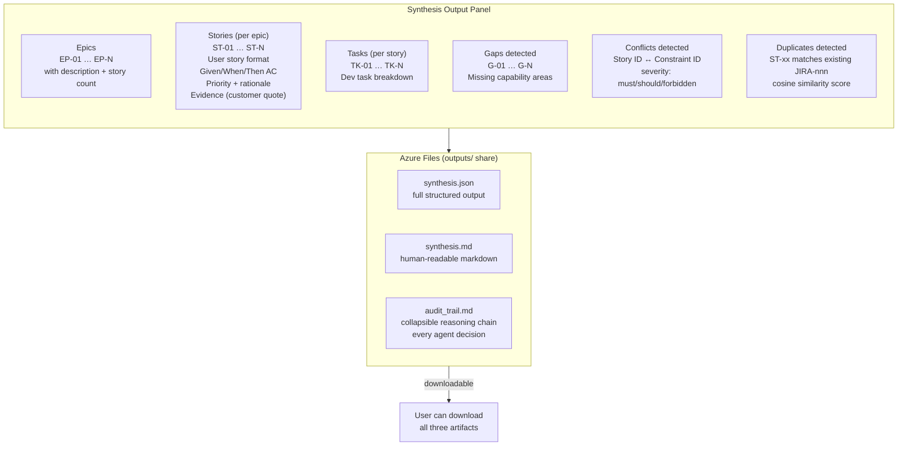

The `audit_trail.md` is the AI-specific debugging artifact — every agent decision recorded with timestamps, the full reasoning, and SHA-256 hash chain verifiable by compliance reviewers.

---

## Step 7 — Guardrail + Security Review

After synthesis, deterministic checks run automatically and results surface as UI chips:

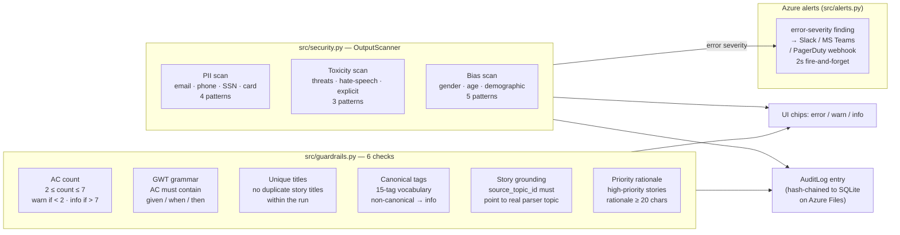

---

## Step 7a — Audit Trail Review (if findings exist)

```mermaid
flowchart LR
    AT["audit_trail.md\n(Azure Files · logs/ share)"]
    subgraph Events["Key audit events"]
        E1["pipeline_start\nrun_id · user_email · model"]
        E2["parse_complete\ntopic count · token usage"]
        E3["story_evidence_attached\nstory_id · source_topic_id · quote"]
        E4["source_topic_id_repaired\ninvalid_id → nearest topic (word-overlap)"]
        E5["guardrail_findings\ncode · severity · story_id"]
        E6["security_finding\ninjection / PII / toxicity"]
        E7["pipeline_complete\ncost_usd · duration_s · story_count"]
    end

    AT --> Events
    Events --> Chain["SHA-256 hash chain\nverify_chain() — each event\nhashes over previous event hash\nSQLite: audit_chain.db"]
    Chain --> Compliance["Compliance reviewer\ncan verify no tampering\nwithout access to app"]
```

---

## Step 8 — Human-in-the-Loop Jira Gate

This is the HITL boundary — the pipeline has already run (HOTL), but writing to Jira is irreversible and requires explicit approval:

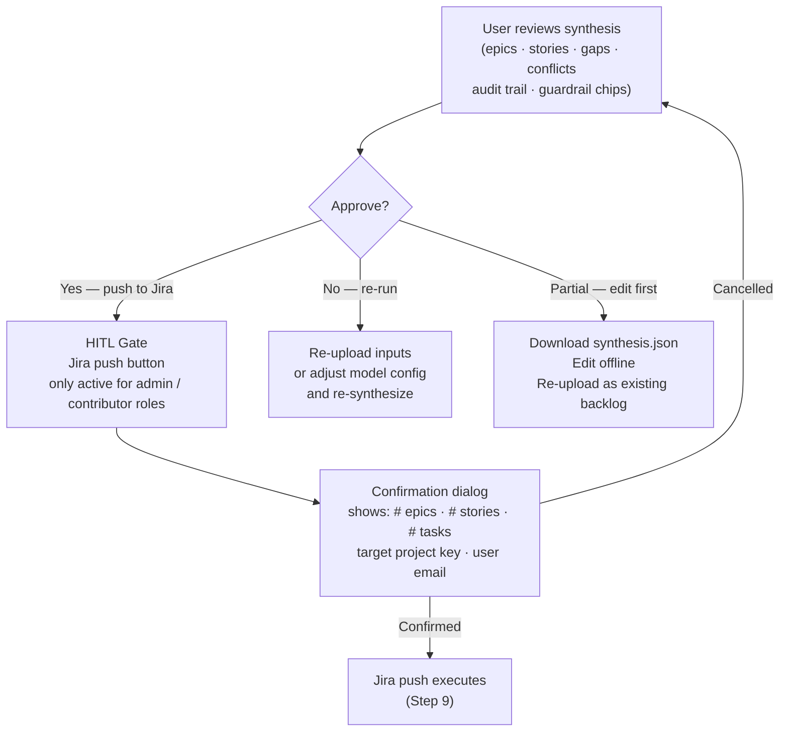

**Why HITL here:**  
A wrong Jira push creates tickets visible to the entire project team, triggers notifications, and may affect sprint planning. Reversing it (bulk-deleting JIRA tickets) is operationally disruptive — so a human gate is mandatory regardless of synthesis quality.

---

## Step 9 — Push to Jira

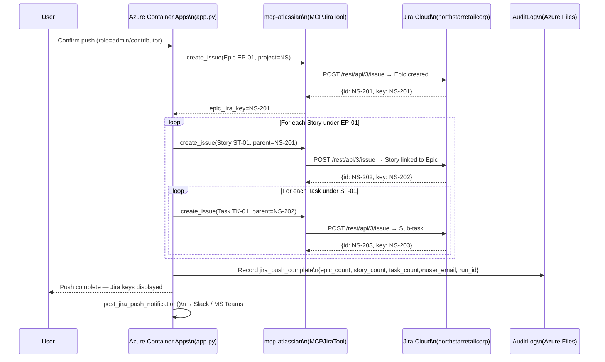

---

## Step 10 — Sync & Monitor

After the backlog is in Jira, the system stays connected for ongoing sync and observability:

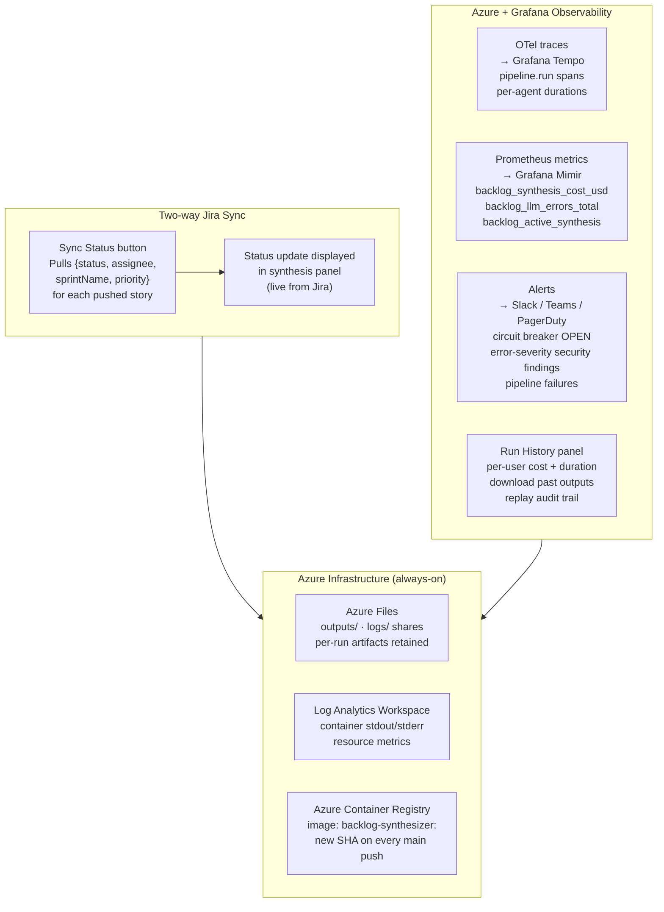

---

## End-to-End on Azure — One-page Summary

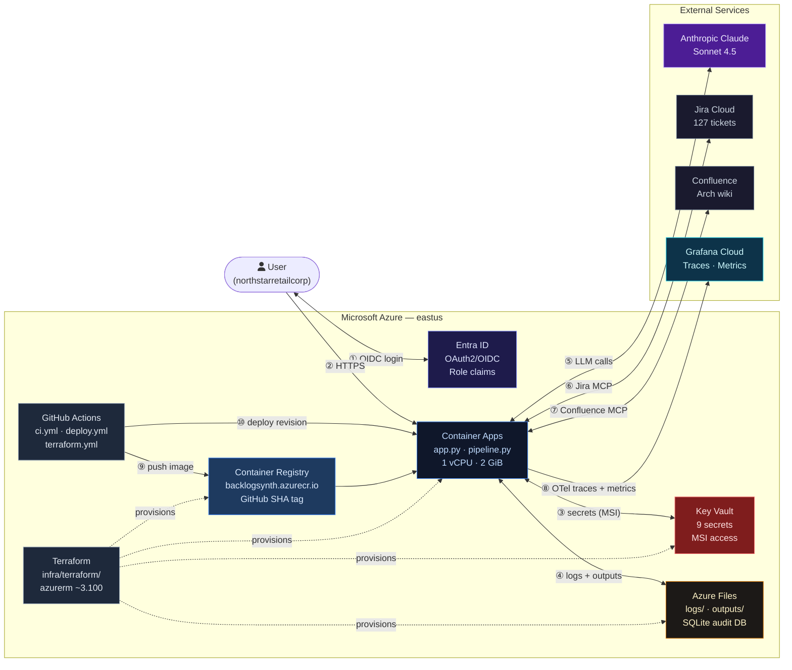

| Step | User action | Azure resource |
|---|---|---|
| ① | Open app URL | Container Apps ingress (HTTPS) |
| ② | Login with Microsoft | Entra ID OAuth2/OIDC |
| ③ | App reads secrets at startup | Key Vault via Managed Identity |
| ④ | Upload transcript / wiki / backlog | Streamlit UI on Container Apps |
| ⑤ | Click Synthesize | LangGraph pipeline — Container Apps CPU |
| ⑥ | Pipeline calls LLMs | Anthropic / Gemini API (external) |
| ⑦ | Pipeline fetches live Jira/Confluence | MCP tools (external) |
| ⑧ | Outputs written | Azure Files (outputs/ share) |
| ⑨ | Review + approve | Browser — Streamlit UI |
| ⑩ | Push to Jira | MCPJiraTool → Jira Cloud |
| ⑪ | Traces + metrics shipped | OTel → Grafana Cloud |
| ⑫ | New code merged → auto-deploy | GitHub Actions → ACR → Container Apps |
